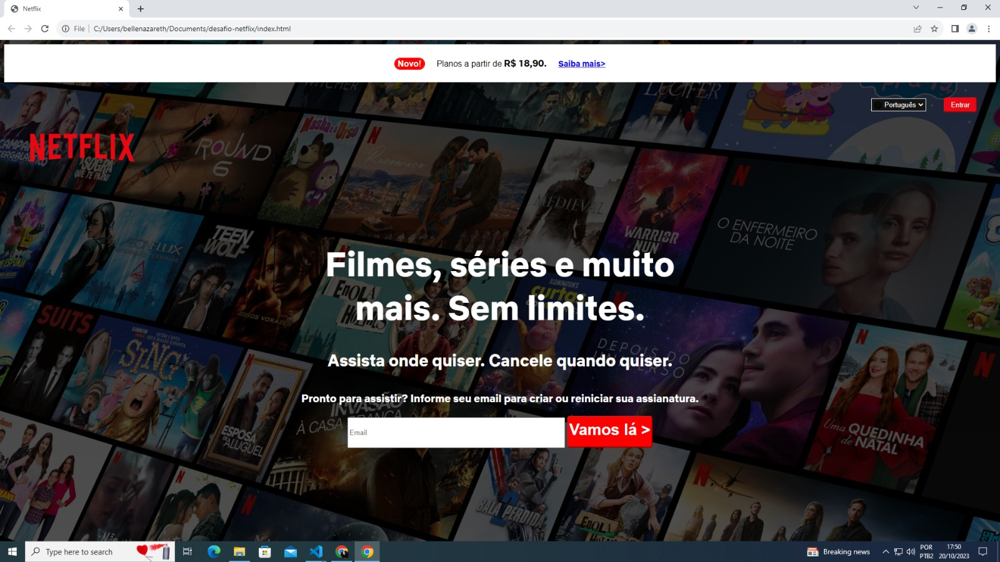

# Desafio-Netlfix

O desafio é criar um clone da página principal da Netflix (acima).

O resultado é a pagina do site sem precisar colocar criar as paginas de link (exemplo: o clique no botão de entrar não precisa redirecionar para a página de login).

## Techs
- Html
- Css

## Criação da Página 

